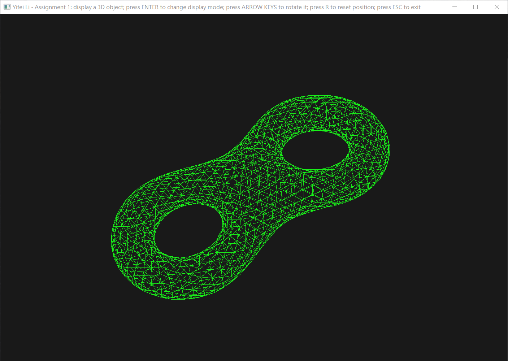
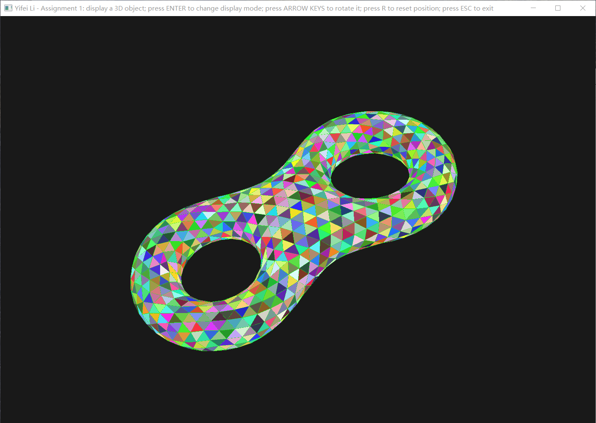

# Assignment 1: Display a 3D model

> Yifei Li

## Assignment description

1. Loading a 3D mesh model and display it on the screen
2. Four modes are supported: wireframe mode, vertex mode, face mode, face and edge mode.  Mode is switched by keyboard. Under the face mode, the color of each face is different.
3. Rotate and translate the model by keyboard
4. Change colors under wireframe mode by keyboard.

Submit code, report and screen recording of program running.

## Environment

- Windows 10 Pro 20H2
- Visual Studio Community 2018 version 16.9.2

## Usage

If you open the VS solution in VS, just build and run. Otherwise, put the GLSL files (`*.vert`, `*.frag`) and the 3D mesh object file (`eight.uniform.obj`) into the same dir as the built `Assignment1.exe` executable, and then run the executable.

Press ENTER to switch among supported display modes (face, face and edge, vertex, wireframe). Press ARROW keys to rotate the object. Press R to reset the position of the object. Press ESC to exit.

## Results and demo

***For a demo video, please refer to `screenshots/demo.mp4`.***

Here are screenshots of each display mode:

## How it works?

### Shaders

Shader files are loaded, compiled, linked and managed by the `Shader` class defined in `Assignment1/shader.hpp`. Two type of shaders are used:

- `face.[vert|frag]`: drawing faces; the color of each face is decided by its first vertex (using `flat` in/out variables, and enables `glProvokingVertex(GL_FIRST_VERTEX_CONVENTION)` option when drawing).
- `point.[vert|frag]`: drawing vertices and wireframe; all vertices and edges share the same color passed to the Shader as a `uniform` variable.

### 3D mesh object

A 3D mesh object is described by its vertices and faces. This is defined with `Vertex`, `TriFace` and `Obj` in `Assignment1/obj.hpp`. Operator `>>` is overloaded to support loading a `.obj` file into an `Obj` instance.

For drawing vertices, edges and faces, we reorganize the vertices data into a vector indicating the order of vertices buffered into the Shader. These are defined in `bindXXX` functions in `Assignment1/main.cpp` which return the number of vertices to draw. And drawing functions are defined as `drawXXX`.

Specifically, in order to draw each face with a different color, a random color is assigned for a vertex when bufferring it. Please refer to class `VertRandColor`.

### Keyboard controlling

Keyboard inputs are captured by the callback function `keyCallback`. When pressing ARROW keys, the model matrix of the object is rotated along certain axis. Axes are pre-defined as `GLM_UP|GLM_DOWN|GLM_LEFT|GLM_RIGHT`.
