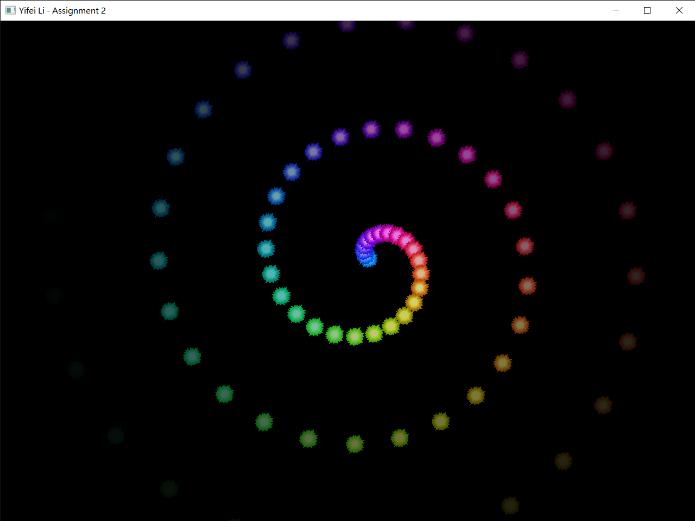
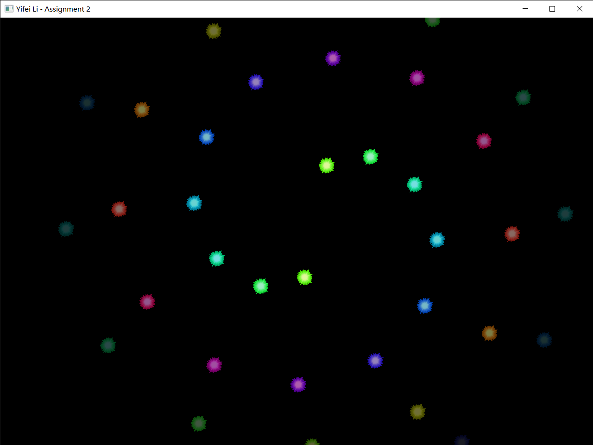
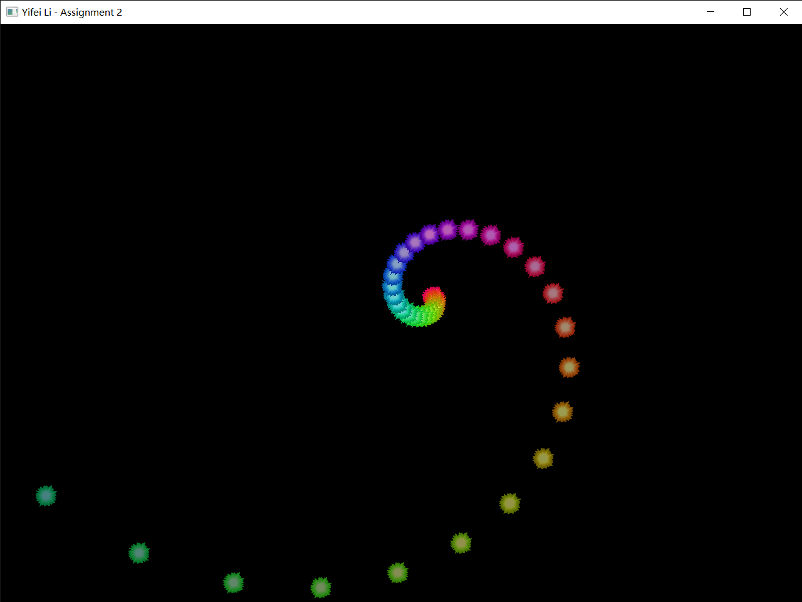

# Assignment 2: Spirals of Star Rotation

> Yifei Li

## Assignment description

1. Multiple stars rotate around a center
2. The colors of stars are different
3. Stars rotate and spread out in spiral path.
4. Use keyboard to switch among spiral types in: a) Archimedes spiral, b) logarithmic spiral and 3) Fermat spiral.

Submit code, report and screen recording of program running.

## Environment

- Windows 10 Pro 20H2
- Visual Studio Community 2019 version 16.9.2
- Please set following environment variables to correctly build the VS project:
  - `GLFW_HOME`: root dir of GLFW version 3.3.3 library
  - `GLAD_HOME`: root dir of GLAD version 4.6 library
  - `GLM_HOME`: root dir of GLM version 0.9.9.8 library
  - `SOIL2_HOME`: root dir of SOIL2 version 1.20 library
  - `FREETYPE_HOME`: root dir of freetype version 2.10.4 library

**NOTE**: This project uses [SOIL2](https://github.com/SpartanJ/soil2) instead of SOIL lib. It is supposed to be able to be used interchangably with SOIL lib. However, if anything goes wrong, please refer to the SOIL2 lib I built for Windows & VS 2019 x64 platform at `lib/SOIL2-1.20.zip`.

## Usage

If you open the VS solution in VS, just build and run. Otherwise, put the GLSL files (`*.vert`, `*.frag`), the font file (`arial.ttf`) and the texture file (`Star.bmp`) into the same dir as the built `bin/hw2.exe` executable, and then run the executable.

- Press ENTER to switch among supported spiral types (Archimedes spiral, Fermat spiral, logarithmic spiral).
- Press CTRL to turn on/off usage text.
- Press ESC to exit.

## Results and demo

***For a demo video, please refer to `demo/demo.mp4`.***

Here are screenshots of each spiral:

## How it works?

### Texture and color

Texture is loaded with SOIL2 lib and then transformed into an OpenGL texture. To remove the background of the star, we discard any point with the sum of its RGB values lower than 1.0. To mixture the texture and the assigned color for the star, we add the texture color and the assigned particle color then minuss 0.5 (instead of multiplying them) to ensure the stars look lighter. The alpha of output color is set to be equal to the assigned particle color to enable the "life" efect of a particle. For more details, please refer to GLSL shader files.

### Spiral

To draw a dynamic spiral with particles, we imagine a spawner (generator) rotating continiously and emit a particle along a radius every $\Delta t$. So the core problem is to decide the speed and position of each particle.

To calculate the speed of a particle at each time $t$, we consider the spiral in a polar coordinate system. Suppose we have $r=r(\theta)$. For each particle, we have
$$\frac{\Delta r}{\Delta \theta}=\frac{\Delta r}{\alpha\Delta t},$$
where $\alpha$ is the angular velocity, $\Delta t$ is the emission interval.

So we have the speed along a radius
$$\frac{\Delta r}{\Delta t}=\alpha \frac{\Delta r}{\Delta \theta}=\alpha\frac{\mathrm{d} r}{\mathrm{d} \theta}.$$

For Archimedes spiral, this $\frac{\mathrm{d} r}{\mathrm{d} \theta}$ is a constant. For logarithmic spiral, $\frac{\mathrm{d} r}{\mathrm{d} \theta}=b\times r$ where $b$ is a parameter. For Fermat spiral, $\frac{\mathrm{d} r}{\mathrm{d} \theta}=\pm \frac{a^2}{r}$ where $a$ is a parameter.

Thus we see for an Archimedes spiral the particle moves with a constant speed; for a logarithmic spiral, its speed is proportional to its radius; and for a Fermat spiral, its speed is inversly proportional to its radius. Also note that for a fermat spiral, the initial offset cannot be 0, and each time the spawner will emit 2 particles in opposite directions due to the $\pm$ in the derivative.

### Particle recycle

To be more flexible, we don't want to specify how many particles we need for a spiral. So we use two deques: one (called `emitted`) to store all emitted and alive particles, another one (called `available`) to store created but dead particles. At the beginning, no particle is pre-generated. When the spawner needs to emit a new particle, it firstly check the `available` deque if there is any free particle, if so it pop one and emit it; otherwise it create a new particle. The spawner also checks the front of `emitted` periodically to recycle all dead particles and push them to the back of `available` deque. This way, eventually there will be a balance and no more new particles need to be created.
