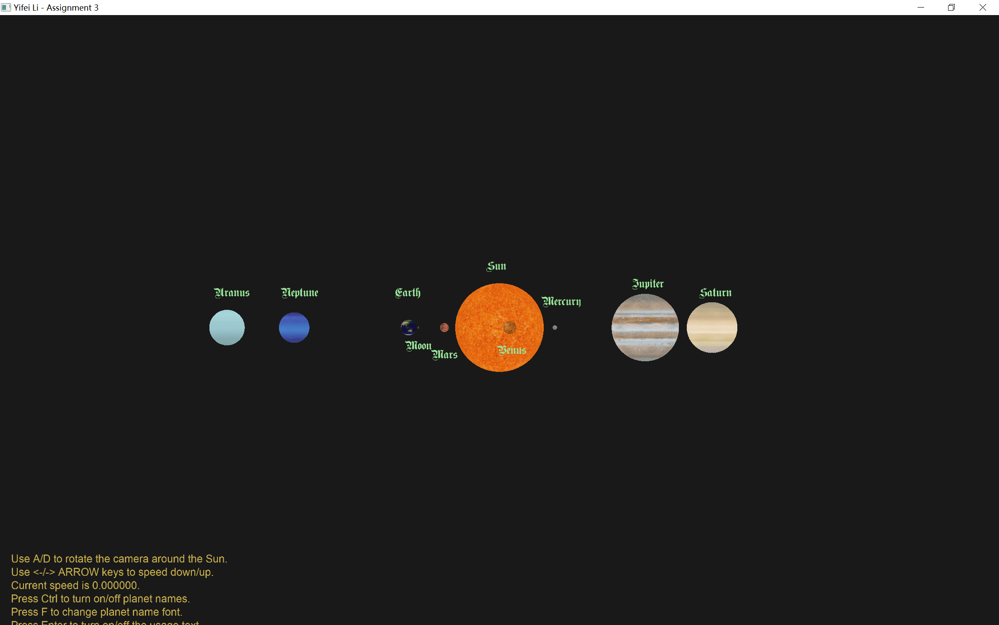

# Assignment 3: Solar System

> Yifei Li

## Assignment description

1. Setting the orbits, sizes and textures of planets (no need to be same as real scale).
2. Add keyboard control. E.g., press → key to increase the rotation speed along the x-axis
3. Add text besides planet. Planets move with names.

Submit code, report and screen recording of program running.

## Environment

- Windows 10 Pro 20H2
- Visual Studio Community 2019 version 16.9.2
- Please set following environment variables to correctly build the VS project:
  - `GLFW_HOME`: root dir of GLFW version 3.3.3 library
  - `GLAD_HOME`: root dir of GLAD version 4.6 library
  - `GLM_HOME`: root dir of GLM version 0.9.9.8 library
  - `SOIL2_HOME`: root dir of SOIL2 version 1.20 library
  - `FREETYPE_HOME`: root dir of freetype version 2.10.4 library

**NOTE**: This project uses [SOIL2](https://github.com/SpartanJ/soil2) instead of SOIL lib. It is supposed to be able to be used interchangably with SOIL lib. However, if anything goes wrong, please refer to the SOIL2 lib I built for Windows & VS 2019 x64 platform in Assignment 2 (hw2).

## Usage

If you open the VS solution in VS, just build and run. Otherwise, put the GLSL files (`*.vert`, `*.frag`), the font files (`arial.ttf`, `Germanica.ttf`) and the texture directory (`textures/`) into the same dir as the built `bin/hw3.exe` executable, and then run the executable.

- Press LEFT/RIGHT ARROW keys (<- or ->) to speed down/up the rotation of planets (speed is constrained to [0, 1] and is shown on the screen).
- Press A/D to rotate the camera around the Sun (it's better to try this when the planet rotation speed is 0).
- Press CTRL to turn on/off planet names.
- Press F to change planet name font.
- Press ENTER to turn on/off usage text.
- Press ESC to exit.

## Results and demo

***For a demo video, please refer to `demo/demo.mp4`.***

Here are screenshots of each spiral:

## How it works?

### Draw a sphere

To draw a sphere, we need to split it into meshes. However, once we have generated a set of meshes for a sphere, actually we can share it among all shperes with different radia. So I build the `Shpere` class upon the `UnitSphere` class. Once defined a unit sphere, we use it to define other spheres which share the vertex buffer of the unit sphere.

### Draw text

Text drawing is based on tutorial code. However, I want it to be more flexible, for we may want to draw different styles of text with different kinds of parameters. So I wrap the `Text` with the C++ "parameter pack". In this way we can easily define multiple types of text drawing.

### Model matrices

Firstly, a sphere has its own model which defines its scaling (radius). Then we need to multiply its model describing the transform and rotation to the left of the model matrix above. So we record the position and rotation angle of each planet. When drawing, we use these info to create the model matrix for a planet. Positions and rotations are updated each time we re-draw the planets.

Note that the origin of the Moon is the Earth, while the origin of the other planets is the Sun.
