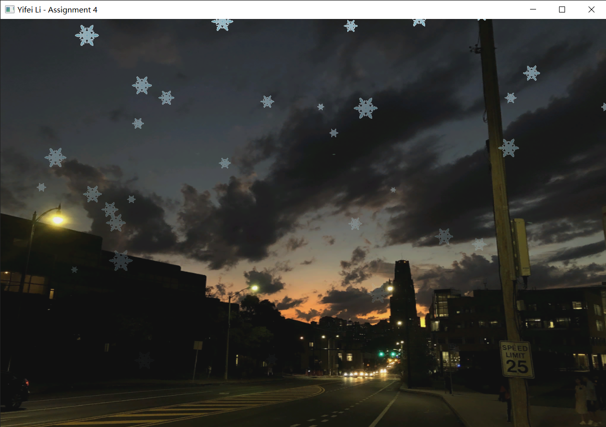

# Assignment 4: Simple particle effect: snowing

> Yifei Li

## Assignment description

1. Particle effect of snowing.
2. Snowflakes have different sizes.
3. Start with less snowflakes and gradually increase the number over time.

You could use any your own texture image as the background.

Submit code, report and screen recording.

## Environment

- Windows 10 Pro 20H2
- Visual Studio Community 2019 version 16.9.2
- Please set following environment variables to correctly build the VS project:
  - `GLFW_HOME`: root dir of GLFW version 3.3.3 library
  - `GLAD_HOME`: root dir of GLAD version 4.6 library
  - `GLM_HOME`: root dir of GLM version 0.9.9.8 library
  - `SOIL2_HOME`: root dir of SOIL2 version 1.20 library

**NOTE**: This project uses [SOIL2](https://github.com/SpartanJ/soil2) instead of SOIL lib. It is supposed to be able to be used interchangably with SOIL lib. However, if anything goes wrong, please refer to the SOIL2 lib I built for Windows & VS 2019 x64 platform in Assignment 2 (hw2).

## Usage

If you open the VS solution in VS, just build and run. Otherwise, put the GLSL files (`*.vert`, `*.frag`) and the texture file (`bg.jpg`, `snow.png`) into the same dir as the built `bin/hw4.exe` executable, and then run the executable. Press ESC to exit.

> The background photo was taken by myself.

## Results and demo

***For a demo video, please refer to `demo/demo.mp4`.***

Here are screenshots of each spiral:

## How it works?

### Drawing

In VBO there is only a quad made up with two triangles. To draw the background, just scale it to the same size as the screen. To draw a snowflake, scale it first and then translate it to where it should be.
As for fragment shader, to remove the white background of the snowflake, we check the sum of the RGB of the sampled texture color, and discard it if the sum is larger than a threshold. The alpha of a snowflake is controlled by a uniform variable `alpha`.

View and projection matrices are also used to keep the scene more realistic.

### Particle system

The snow particle system is based on the tutorial code and my own implementation in Assignment 2 (hw2). The prticle recycling mechanism introduced in Assignment 2 is also utilized.

When a snowflake is initialized, it chooses a random position beyond the top of the visible region and starts with an initial speed. Gravity is applied so that the snowflake falls with an acceleration. Also the alpha of a snowflake fades with time and finally disappears. When its life comes to zero it is recycled.

As for the controlling, user defines a initial (max) period of emitting snowflake. Then this period decreases with a speed also custmized by user until some minimum. In this way the scene starts with less snowflakes and gradually increase the number over time.

There is a timer variable which minus the delta time each update. When it comes to zero, a new snowflake is emitted. Then the timer is reset again with a random value no more then current emission period.
