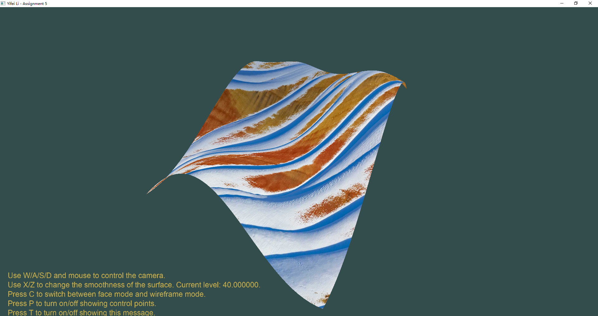
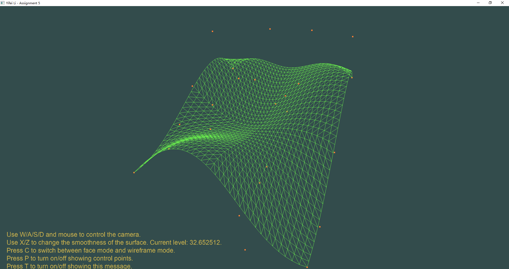

# Assignment 5: Bézier surface

> Yifei Li

## Assignment description

1. Use 25 (5 x 5) control points
2. Use TCS to set subdivision level
3. Use TES to calculate new vertex coordinates and texture coordinates according to the mathematical equation of Bézier surface
4. Change smoothness of the surface by keyboard
5. Support wireframe mode display.
6. Add texture to Bézier surface. Choose the texture by yourself.

## Environment

- Windows 10 Pro 20H2
- Visual Studio Community 2019 version 16.9.2
- Please set following environment variables to correctly build the VS project:
  - `GLFW_HOME`: root dir of GLFW version 3.3.3 library
  - `GLAD_HOME`: root dir of GLAD version 4.6 library
  - `GLM_HOME`: root dir of GLM version 0.9.9.8 library
  - `SOIL2_HOME`: root dir of SOIL2 version 1.20 library
  - `FREETYPE_HOME`: root dir of freetype version 2.10.4 library

**NOTE**: This project uses [SOIL2](https://github.com/SpartanJ/soil2) instead of SOIL lib. It is supposed to be able to be used interchangably with SOIL lib. However, if anything goes wrong, please refer to the SOIL2 lib I built for Windows & VS 2019 x64 platform in Assignment 2 (hw2).

## Usage

If you open the VS solution in VS, just build and run. Otherwise, put the GLSL files (`*.vert`, `*.frag`, `*.tesc`, `*.tese`), the font files (`arial.ttf`) and the texture file (`Snow.jpg`) into the same dir as the built `bin/hw5.exe` executable, and then run the executable.

- Use W/A/S/D and mouse to control the camera.
- Use X/Z to change the smoothness of the surface.
- Press C to switch between face mode and wireframe mode.
- Press P to turn on/off showing control points.
- Press T to turn on/off showing this message.
- Press ESC to exit.

## Results and demo

***For a demo video, please refer to `demo/demo.mp4`.***

Here are screenshots:

## How it works?

Mostly based on tutorial code. To extend it to 5x5 control points, the Berstein polynomials should be changed to $n=4$ version, i.e.
$$B_{i,4}(u)=C_4^i u^i(1-u)^{4-i}.$$

Also, the surface equation should also be
$$S(u,v)=\sum_{i=0}^4\sum_{j=0}^4B_{i,4}(u)B_{j,4}(v)p_{i,j},$$
where $p_{i,j}$ is the control point on row $i$ column $j$.

In TCS `bezier.tesc`, the `vertices` in `layout` should be changed to 25. In TES, to make life easier, I use arrays to store control points and Berstein polynomials. Thus when computing the final result I can simply use loops to take sum as shown in the equation above.

When drawing the wireframe, I also set a boolean variable to indicate using pure color instead of using texture.
