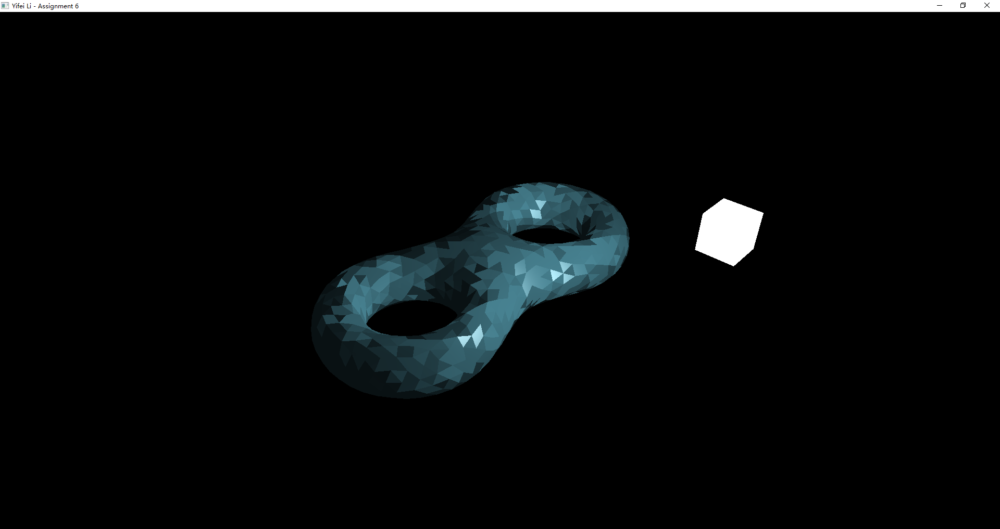

# Assignment 6: Illumination effect

> Yifei Li

## Assignment description

1. Load the 3D model, rotate and zoom it with keyboard/mouse (assignment1)
2. Generate several different illumination effects by using different parameter settings of object's material and lighting.
3. All faces have same color.
4. Implement 2 modes, use a) normal vector for each triangle; b) average normal vector of a vertex's surrounding triangles. (See 1.png and 4.png)
5. (Optional, no bonus) Draw the light source together with object.

Submit code, report and screen recording of program running.

## Environment

- Windows 10 Pro 20H2
- Visual Studio Community 2019 version 16.9.3
- Please set following environment variables to correctly build the VS project:
  - `GLFW_HOME`: root dir of GLFW version 3.3.3 library
  - `GLAD_HOME`: root dir of GLAD version 4.6 library
  - `GLM_HOME`: root dir of GLM version 0.9.9.8 library
  - `SOIL2_HOME`: root dir of SOIL2 version 1.20 library
  - `FREETYPE_HOME`: root dir of freetype version 2.10.4 library

**NOTE**: This project uses [SOIL2](https://github.com/SpartanJ/soil2) instead of SOIL lib. It is supposed to be able to be used interchangably with SOIL lib. However, if anything goes wrong, please refer to the SOIL2 lib I built for Windows & VS 2019 x64 platform in Assignment 2 (hw2).

## Usage

If you open the VS solution in VS, just build and run. Otherwise, put the GLSL files (`*.vert`, `*.frag`), the font files (`arial.ttf`) and the object file (`eight.uniform.obj`) into the same dir as the built `bin/hw6.exe` executable, and then run the executable.

- Use W/A/S/D and mouse to control the camera.
- Use X/Z and ARROW keys to move the lamp.
- Use R/T, G/H and B/N to change the RGB value of material color.
- Use -/= to change the shininess of material.
- Use [ or ] to scale the object.
- Press CTRL to switch between using average normals or face normals.
- Press ALT to turn on/off showing usage message.
- Press ESC to exit.

## Results and demo

***For a demo video, please refer to `demo/demo.mp4`.***

Here are screenshots:

## How it works?

### Object and cameral control

Note that although the assignment description requires "rotate the object", this is actually equal to move the camera and the lamp. So we only support zooming the object directly. And to translate/rotate the object, please instead move the camera or the lamp.

### Phong lighting model

Mostly based on the tutorial code. To support using the face normals instead of using the averaged normals, the Vertex Shader additionaly outputs a `flat` normal. In Fragement Shader there is a boolean variable `useFaceNormal` deciding whether to use the `flat` normal or the ordinary normal (which will be interpolated).

Material color and shininess can be changed and set by user. Also the lamp position can be changed.

### Computing normals

To use the average normal for each vertex, just iterate all faces and sum the face normals for all surrounding faces of a vertex. Otherwise, just assign the face normal to a corresponding vertex directly.

When calculating the face normal, we use the `glm::cross` to compute the cross product of two vectors.
